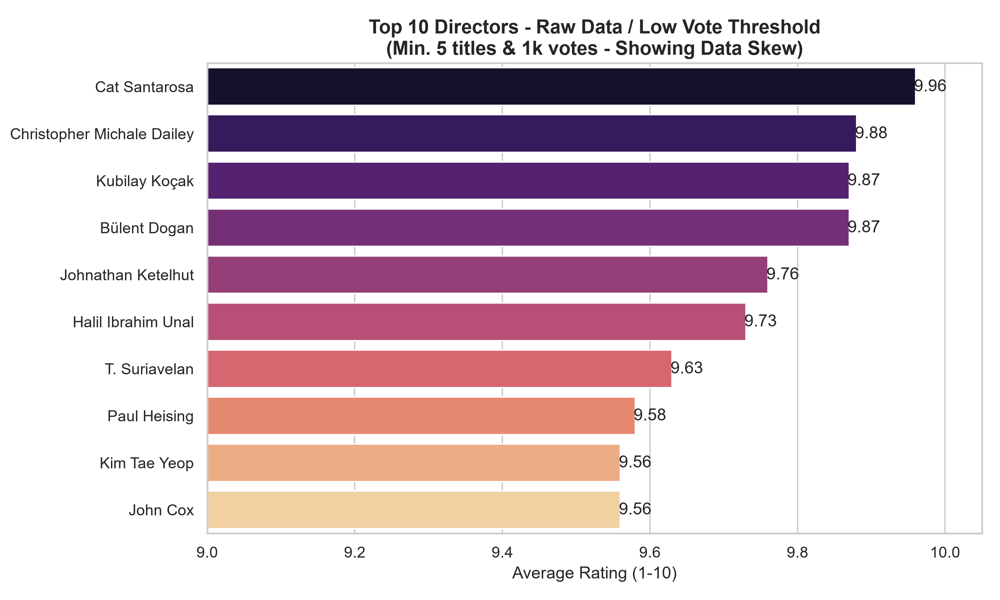
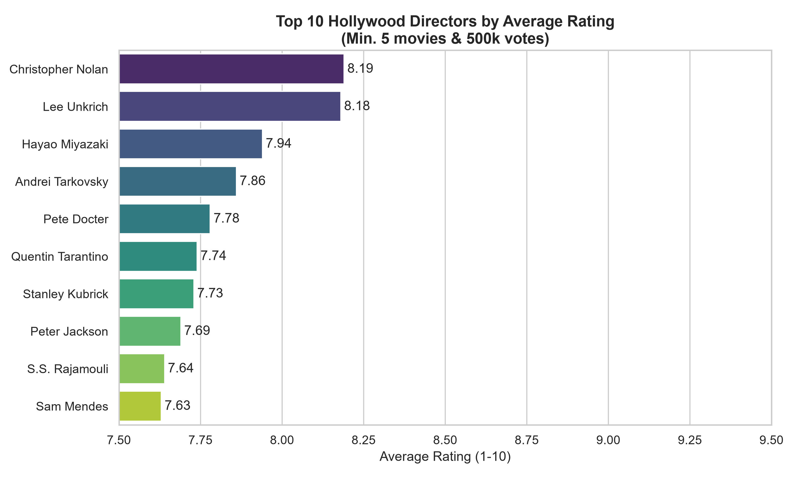
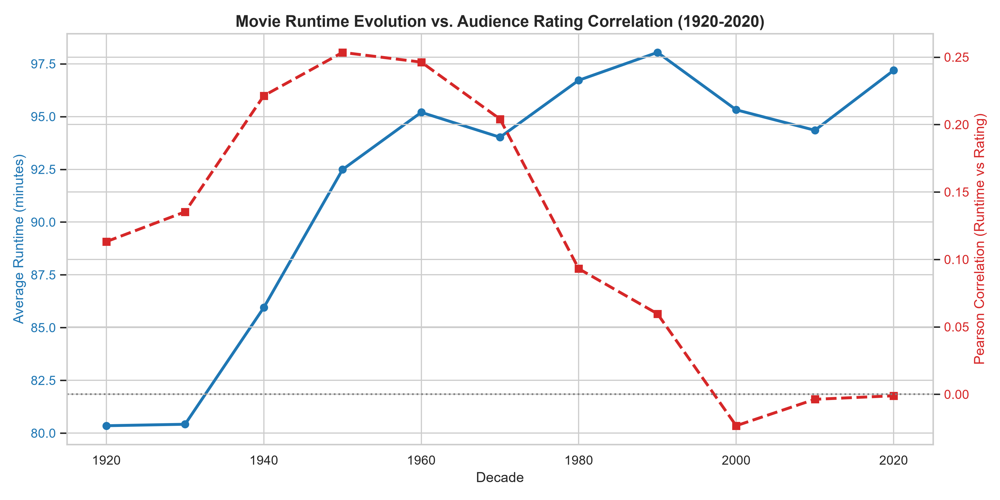
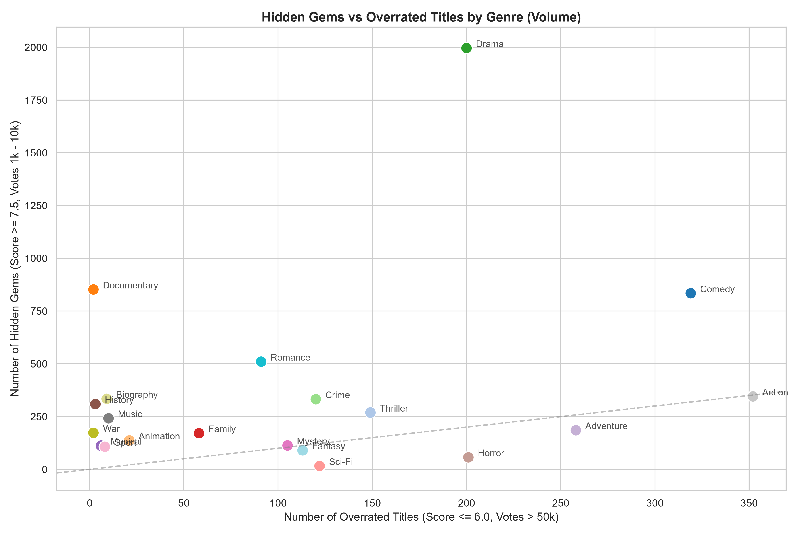

# IMDb Data Engineering Pipeline

An end-to-end data pipeline that extracts raw IMDb datasets, loads them into a local database, and transforms them into a star-schema dimensional model.

## 🛠 Tech Stack & Architecture
* **Orchestrator:** Apache Airflow (using Python and Bash Operators)
* **Transformer:** dbt
* **Database:** DuckDB
* **Infrastructure:** Python & Docker

## 📂 Project Structure

```text
.
├── airflow/                    # Airflow orchestration and dependencies
│   ├── dags/
│   │   ├── imdb_cosmos.py      # DAG version using Astronomer Cosmos
│   │   └── imdb_pipeline.py    # Main DAG version using sequential BashOperators
│   └── requirements.txt        # Airflow-specific Python dependencies
├── analyses/                   # Business analytical queries (.sql)
├── data/                       # Directory for the raw IMDb datasets (.tsv.gz)
├── dbt_packages/               # External dbt packages
├── logs/                       # Airflow and pipeline execution logs
├── macros/                     # dbt macros for custom SQL functions (e.g., get_decade.sql)
    └── tests/                  # macros for tests
├── models/                     # dbt SQL transformation models
│   ├── staging/                # Layer 1: Cleans and casts raw data views
│   ├── intermediate/           # Layer 2: Joins and prepares business logic
│   └── marts/                  # Layer 3: Dimensional modeling (Fact & Dimension tables)
├── scripts/                    # Python scripts
│   ├── generate_charts.py      # Script for generating analytical charts via Python/Seaborn
│   └── load_imdb.py            # Python script for ingestion into DuckDB
├── seeds/                      # dbt seed files (static mapping CSVs)
├── snapshots/                  # dbt snapshots for SCD Type 2 tracking (e.g., dim_title)
├── tests/                      # Custom dbt data tests
├── visualizations/             # Auto-generated analytical plots (.png)
├── warehouse/                  # Destination for the compiled imdb.duckdb database file
├── .env / .env.example         # Environment variables setup
├── db_original.md              # Documentation regarding the raw IMDb schema
└── db_star.md                  # Documentation regarding the final Star Schema design
```

## 📥 1. Getting the Raw Data (Prerequisite)
Before running anything, you need to download the raw datasets from IMDb.
1. Go to the [official IMDb Datasets page](https://datasets.imdbws.com/).
2. Download the following compressed files (`.tsv.gz`):
   * `name.basics.tsv.gz`
   * `title.akas.tsv.gz`
   * `title.basics.tsv.gz`
   * `title.crew.tsv.gz`
   * `title.episode.tsv.gz`
   * `title.principals.tsv.gz`
   * `title.ratings.tsv.gz`
3. Place all the downloaded `.tsv.gz` files directly into the `data/` folder in your project root. **Do not extract them**; the Python script is designed to read the compressed files directly into DuckDB.

## 🐳 2. Running via Airflow (Docker)
To run the fully automated pipeline orchestrated by Airflow:

1. Copy the environment variables template to create your local configuration file:
   * **Linux / macOS / WSL:**
     ```bash
     cp .env.example .env
     ```
   * **Windows (PowerShell / CMD):**
     ```cmd
     copy .env.example .env
     ```
2. Clean the environment by deleting any existing `warehouse/imdb.duckdb` file.
3. Spin up the Docker containers using:
   ```bash
   docker compose up -d
   ```
4. Access the Airflow UI at `http://localhost:8084` (credentials: `admin` / `admin`).
5. Unpause and trigger the `imdb_pipeline` DAG to execute all stages sequentially.

## 💻 3. Running Locally (Without Airflow)
If you want to test the pipeline directly in your local terminal without spinning up the Airflow containers, ensure your Python virtual environment (`.venv`) is active and run the following commands sequentially from the **project root**:

1. **Set up the Python Environment & Install Dependencies:**
   Create and activate a virtual environment, then install the required Python packages (including dbt-duckdb, pandas, seaborn, etc.):
   ```bash
   python -m venv .venv
   source .venv/bin/activate  # On Windows use: .venv\Scripts\activate
   pip install --upgrade pip
   pip install -r airflow/requirements.txt
   # Or install visualization libraries if running the charts script:
   pip install duckdb pandas matplotlib seaborn
2. **Clean the slate:** Delete the `warehouse/imdb.duckdb` file for a fresh start.
3. **Extract & Load:** Run the extraction script to build the Bronze layer:
   ```bash
   python scripts/load_imdb.py
   ```
4. **Transform & Test (via dbt):** Execute the transformation layers directly in the root directory:
   ```bash
   dbt deps
   dbt run --select staging.*
   dbt run --select intermediate.*
   dbt snapshot
   dbt run --select marts.*
   dbt test
   ```
    Or, all in one command:
    ```bash
    dbt build
    ```

## 📊 4. Business Questions (Analyses)
**Note on Reproducibility:** *The insights, queries, and visualizations provided below are based on a snapshot of the IMDb dataset extracted in **August 2026**. Because IMDb continuously updates its database, running this pipeline at a later date will result in slightly different figures.*

The project addresses specific business questions regarding the IMDb dataset. The analytical queries are stored in the `analyses/` directory and leverage the compiled Star Schema.


### Included Queries:
*   **Q1: Top 10 Directors by Average Rating**
    *   `q1_v1_top_directors_raw.sql`: Initial attempt (shows the impact of "data skew" from obscure titles).
    *   `q1_v2_top_directors_high_votes.sql`: Increased vote threshold (shows how TV/Anime directors dominate fan ratings).
    *   `q1_v3_top_directors_movies_only.sql`: Final refinement (filters strictly for feature films to reveal true Hollywood top directors).
*   **Q2: Movie Runtime Evolution**
    *   `q2_runtime_by_decade.sql`: Analyzes the evolution of movie runtime by decade and calculates its correlation with average ratings.
*   **Q3: Hidden Gems vs. Overrated Titles**
    *   `q3_hidden_gems.sql`: Ranks genres based on their ratio of "hidden gems" (high rating, low votes) to "overrated" films (low rating, high votes).

### How to Run the Analyses:
To view the final executable SQL for these queries, run the following command in the project root:
```bash
dbt compile
```
You can then find the pure SQL queries in the `target/compiled/imdb_project/analyses/` folder. Paste these queries into your preferred SQL client (like DBeaver) connected to the `imdb.duckdb` database to view the results.

### 💡 Key Insights & Conclusions & Visualizations
Running the analytical queries revealed several interesting facts about the film industry and IMDb user behavior:

*   **Q1: The "Data Skew" in Director Ratings:**
    *   *Attempt 1 & 2:* Initially, simply filtering by a minimum number of votes placed obscure short-film directors or famous Anime/TV episode directors (e.g., Megumi Ishitani for *One Piece*) at the top of the list. TV episodes consistently receive much higher baseline ratings than feature films.
    *   *Conclusion:* By strictly joining the staging layer and filtering for `title_type = 'movie'`, the true top-rated Hollywood cinema directors emerged (e.g., Christopher Nolan, Quentin Tarantino).
    *   **Visual Comparison (Raw Data Skew vs. Filtered Movies):**
        <p align="center">
          
          
        </p>

*   **Q2: The Evolution of Movie Runtimes:**
    *   *Runtime:* Contrary to the popular belief that "movies are getting too long today," the average feature film runtime has remained incredibly stable at around **94-97 minutes** since the 1980s.
    *   *Correlation:* During the "Golden Age" (1940s-1970s), there was a positive correlation between longer runtimes and higher ratings. Back then, grand epics (such as *Lawrence of Arabia* or *The Godfather*) required massive investments and were treated as prestigious cultural events that audiences deeply appreciated. In the modern era (2000s-2020s), that correlation has dropped almost to zero, meaning a long runtime no longer guarantees a highly-rated movie.
    *   **Runtime Evolution & Correlation Chart:**
        <p align="center">
          
        </p>

*   **Q3: Hidden Gems vs. Overrated Blockbusters:**
    *   *Hidden Gems:* **Documentary, History, and War** genres have the highest ratio of hidden gems. These niche genres attract passionate audiences who rate them highly, but they rarely reach mainstream vote counts.
    *   *Overrated:* **Sci-Fi, Horror, and Action** have the worst ratios. These genres often rely on massive marketing budgets, attracting huge audiences (high vote counts) but frequently failing to deliver on quality, resulting in mediocre or poor ratings.
    *   **Hidden Gems vs Overrated Scatter Plot:**
        <p align="center">
          
        </p>

