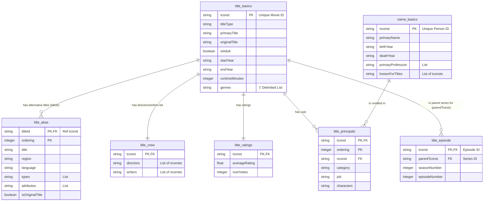

# Source Data Documentation: IMDb Non-Commercial Dataset

This document describes the structure of the raw data files downloaded from IMDb, before being processed and cleaned in dbt.

## 1. Entity-Relationship Diagram (ERD)

---

## 2. Data Dictionary & Table Structures

### The Productions Pillar (Primary Key: `tconst`)

**`title.basics` (The Main Movie/Show Table)**
This is the core dimension for all productions.
*   **`tconst`** (string): The unique ID for the movie or show.
*   **`titleType`** (string): The format (e.g., *movie, tvseries, short*).
*   **`primaryTitle`** & **`originalTitle`** (string): The popular release name vs. the original language name.
*   **`isAdult`** (boolean): `1` if adult content, `0` otherwise.
*   **`startYear`** & **`endYear`** (YYYY): Release/air years. `endYear` is `\N` for movies.
*   **`runtimeMinutes`** (integer): Length in minutes.
*   **`genres`** (string array): A comma-separated list (e.g., "Action,Comedy").

**`title.akas` (Alternative Titles & Translations)**
Stores how a movie was translated or named in different regions.
*   **`titleId`** (string): Matches `tconst` (links back to the main movie).
*   **`ordering`** (integer): ID to keep rows unique when a movie has multiple translations.
*   **`title`** (string): The translated/localized name.
*   **`region`** & **`language`** (string): Where this version is used.
*   **`types`** & **`attributes`** (array): Extra tags (e.g., *dvd, festival, original*).
*   **`isOriginalTitle`** (boolean): `1` if it's the original title, `0` if translated.

**`title.ratings` (Scores & Votes)**
The raw fact table for user ratings.
*   **`tconst`** (string): The movie ID.
*   **`averageRating`** (float): The actual grade (e.g., 8.5).
*   **`numVotes`** (integer): Total number of people who voted.

**`title.episode` (TV Show Hierarchy)**
Used only for series to map episodes to their parent shows.
*   **`tconst`** (string): The ID of the *specific episode*.
*   **`parentTconst`** (string): The ID of the *main show*.
*   **`seasonNumber`** & **`episodeNumber`** (integer): Self-explanatory.

---

### The Persons Pillar (Primary Key: `nconst`)

**`name.basics` (Actors, Directors & Crew)**
The core dimension for industry personnel.
*   **`nconst`** (string): The unique ID for the person.
*   **`primaryName`** (string): Their usual credited name.
*   **`birthYear`** & **`deathYear`** (YYYY): `\N` if missing or still alive.
*   **`primaryProfession`** (array): Comma-separated list of their top 3 jobs.
*   **`knownForTitles`** (array): A quick list of their top 4 movies.
---

### The Intersection Tables (Linking Movies to People)

**`title.crew` (Directors & Writers Quick List)**
A preliminary, denormalized link between movies and their creators.
*   **`tconst`** (string): The movie ID.
*   **`directors`** & **`writers`** (arrays): Comma-separated lists of `nconst` IDs.

**`title.principals` (The Detailed Cast & Crew Table)**
The ultimate bridge table. Shows exactly what role a person had in a movie, down to the character level.
*   **`tconst`** (string): The movie ID.
*   **`nconst`** (string): The person ID.
*   **`ordering`** (integer): Billing order (who shows up first in the credits).
*   **`category`** (string): General role (e.g., *actor, director, composer*).
*   **`job`** (string): Specific role (e.g., *assistant director*). Will be `\N` for regular actors.
*   **`characters`** (string): JSON array of character names played (e.g., `["Batman", "Bruce Wayne"]`).
