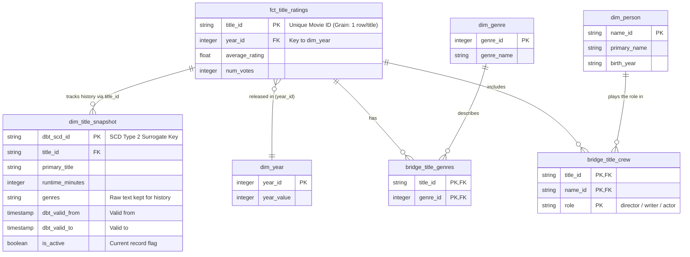

# dbt Architecture Documentation: IMDb Star Schema

This document describes the optimized database structure (Star Schema) designed to meet the analytical requirements of the IMDb project. The architecture transforms the highly denormalized raw data into a true star schema centered around a fact table with a grain of one row per title.

## 1. Entity-Relationship Diagram (ERD)

---

## 2. Data Dictionary & Table Structures

### The Fact Table

**`fct_title_ratings` (Core Metrics)**
This is the core table of the model, built at a strict grain of one row per title. It stores the quantitative metrics on which aggregations and averages will be calculated.
*   **`tconst`** (string): The alphanumeric unique identifier of the title (Foreign Key). This defines the explicit grain of one row per title.
*   **`year_id`** (integer): Foreign key mapping to `dim_year`.
*   **`averageRating`** (float): The weighted average of all individual user ratings.
*   **`numVotes`** (integer): The total number of votes the title has received.

### Dimension Tables

**`dim_title_snapshot` (SCD Type 2 Movie Metadata)**
Implements a Slowly Changing Dimension (SCD Type 2) via a dbt snapshot on core descriptive attributes. It tracks periodic corrections IMDb makes to metadata between weekly loads.
*   **`dbt_scd_id`** (string): The surrogate key generated by dbt to uniquely identify a specific historical version of a title's record.
*   **`tconst`** (string): The natural key of the title.
*   **`primaryTitle`** (string): The popular title.
*   **`runtimeMinutes`** (integer): The primary runtime of the title in minutes.
*   **`genres`** (string): The raw delimited string of genres, retained here to track historical reclassifications over successive loads.
*   **`dbt_valid_from`** (timestamp): The exact timestamp when this version of the metadata became active.
*   **`dbt_valid_to`** (timestamp): The exact timestamp when this version of the metadata was overwritten or expired (NULL if currently active).
*   **`is_active`** (boolean): A derived flag (True/False) indicating if this is the current, active record for the title (where `dbt_valid_to` is null).

**`dim_person` (Industry Personnel)**
Includes the unique details for each person. This dimension is built by exploding the `knownForTitles` column from the raw data.
*   **`nconst`** (string): The alphanumeric unique identifier of the person.
*   **`primaryName`** (string): The name by which the person is most often credited.
*   **`birthYear`** (string): The person's birth year.

**`dim_year` (Time Dimension)**
A helper dimension required to accelerate global filters in the final queries, such as aggregating runtime by decade.
*   **`year_id`** (integer): A surrogate key for the year.
*   **`year_value`** (integer): The integer representation of the year (e.g., 1994, 2023), used to group titles into decades.

**`dim_genre` (Genre Dimension)**
A helper dimension used to normalize genre names.
*   **`genre_id`** (integer): A surrogate key for the genre.
*   **`genre_name`** (string): The individual name of the genre (e.g., Action, Comedy).

### Bridge Tables

**`bridge_title_genres` (Genre M:M Resolver)**
A many-to-many bridge table built by splitting the pipe-delimited genres column.
*   **`tconst`** (string): Foreign key pointing to the title.
*   **`genre_id`** (integer): Foreign key pointing to the specific genre.

**`bridge_title_crew` (Cast & Crew M:M Resolver)**
Unifies the cast files (`title.crew` and `title.principals`) into a single clear table indicating the title, person, and role.
*   **`tconst`** (string): Foreign key pointing to the title.
*   **`nconst`** (string): Foreign key pointing to the person.
*   **`role`** (string): The category of the job the person performed (e.g., director, writer, actor).
